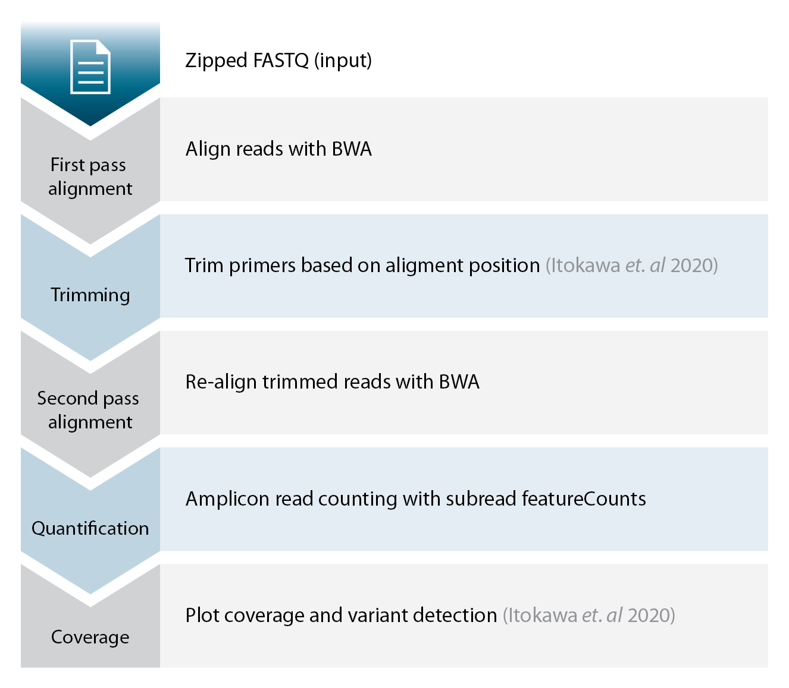

# Lexogen - QuantSeq Flex ARTIC primer set for SARS-Cov2 genome sequencing

## Introduction 

This repository contains resources and information related to the QuantSeq Flex ARTIC primer set. 
The primers in this set are based on the published sequences (version N1) of [Kentaro Itokawa et. al 2020](https://journals.plos.org/plosone/article?id=10.1371/journal.pone.0239403). See also [this github repository](https://github.com/ItokawaK/Alt_nCov2019_primers) for more information and the original sequences.

## Data analysis
The figure below details an example how the obtained data could be analyzed and is based workflow and tools published by [Kentaro Itokawa et. al](https://journals.plos.org/plosone/article?id=10.1371/journal.pone.0239403). We have futhermore included a basic example script [here](example_workflow/example_workflow.sh)

## Content overview

1. (primers)[https://github.com/Lexogen-Tools/ARTIC_SARS-CoV-2/primers]
The primer sequences, binding positions and amplicion ranges with respect to the MN908947.3 genome assembly.

2. (example_workflow)[https://github.com/Lexogen-Tools/ARTIC_SARS-CoV-2/example_workflow]
A showcase script on how to perform data analysis. 

## Refereces

* Itokawa K, Sekizuka T, Hashino M, Tanaka R, Kuroda M (2020) Disentangling primer interactions improves SARS-CoV-2 genome sequencing by multiplex tiling PCR. PLoS ONE 15(9): (e0239403)[https://journals.plos.org/plosone/article?id=10.1371/journal.pone.0239403]

* https://github.com/ItokawaK/Alt_nCov2019_primers 

* https://github.com/artic-network/artic-ncov2019
